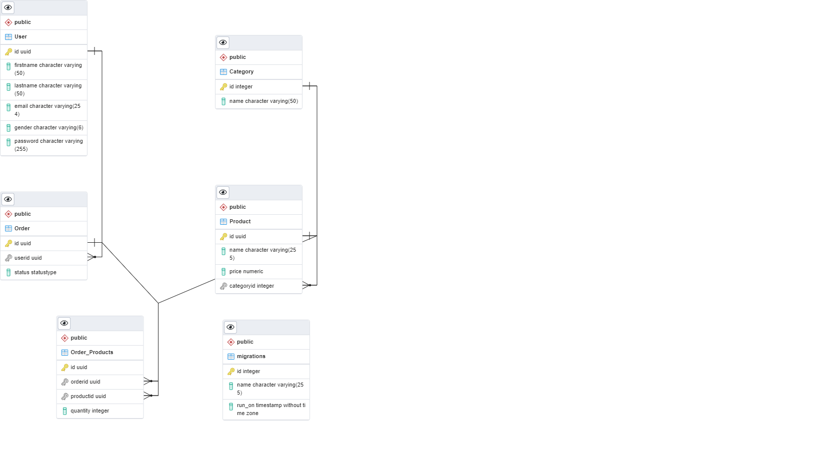

# Database Diagram



# Routes

Please check Swagger Documentation via [Swagger UI Documentation](http://localhost:8080/api/v1/) or Or You can Download [Postman Collection](https://raw.githubusercontent.com/hamed-farag/storefront/master/Storefront.postman_collection.json).

# 📁 Collection: User

## End-point: Sign Up

### Method: POST

> ```
> http://localhost:8080/api/v1/user/signup
> ```

### Headers

| Content-Type | Value            |
| ------------ | ---------------- |
| Accept       | application/json |

### Headers

| Content-Type | Value            |
| ------------ | ---------------- |
| Content-Type | application/json |

### Body (**raw**)

```json
{
    "email": "user@user.com1",
    "firstName": "First",
    "lastName": "Last",
    "gender": "male",
    "password": "987456321"
}
```

⁃ ⁃ ⁃ ⁃ ⁃ ⁃ ⁃ ⁃ ⁃ ⁃ ⁃ ⁃ ⁃ ⁃ ⁃ ⁃ ⁃ ⁃ ⁃ ⁃ ⁃ ⁃ ⁃ ⁃ ⁃ ⁃ ⁃ ⁃ ⁃ ⁃ ⁃ ⁃ ⁃ ⁃ ⁃ ⁃ ⁃ ⁃ ⁃ ⁃ ⁃ ⁃ ⁃ ⁃ ⁃ ⁃ ⁃

## End-point: Sign In

### Method: POST

> ```
> http://localhost:8080/api/v1/user/signin
> ```

### Headers

| Content-Type | Value            |
| ------------ | ---------------- |
| Accept       | application/json |

### Headers

| Content-Type | Value            |
| ------------ | ---------------- |
| Content-Type | application/json |

### Body (**raw**)

```json
{
    "email": "user@user.com",
    "password": "987456321"
}
```

⁃ ⁃ ⁃ ⁃ ⁃ ⁃ ⁃ ⁃ ⁃ ⁃ ⁃ ⁃ ⁃ ⁃ ⁃ ⁃ ⁃ ⁃ ⁃ ⁃ ⁃ ⁃ ⁃ ⁃ ⁃ ⁃ ⁃ ⁃ ⁃ ⁃ ⁃ ⁃ ⁃ ⁃ ⁃ ⁃ ⁃ ⁃ ⁃ ⁃ ⁃ ⁃ ⁃ ⁃ ⁃ ⁃ ⁃

# 📁 Collection: Category

## End-point: All

### Method: GET

> ```
> http://localhost:8080/api/v1/category
> ```

### Headers

| Content-Type | Value            |
| ------------ | ---------------- |
| Accept       | application/json |

### Headers

| Content-Type | Value            |
| ------------ | ---------------- |
| Content-Type | application/json |

⁃ ⁃ ⁃ ⁃ ⁃ ⁃ ⁃ ⁃ ⁃ ⁃ ⁃ ⁃ ⁃ ⁃ ⁃ ⁃ ⁃ ⁃ ⁃ ⁃ ⁃ ⁃ ⁃ ⁃ ⁃ ⁃ ⁃ ⁃ ⁃ ⁃ ⁃ ⁃ ⁃ ⁃ ⁃ ⁃ ⁃ ⁃ ⁃ ⁃ ⁃ ⁃ ⁃ ⁃ ⁃ ⁃ ⁃

## End-point: ById

### Method: GET

> ```
> http://localhost:8080/api/v1/category/1
> ```

### Headers

| Content-Type | Value            |
| ------------ | ---------------- |
| Accept       | application/json |

### Headers

| Content-Type | Value            |
| ------------ | ---------------- |
| Content-Type | application/json |

⁃ ⁃ ⁃ ⁃ ⁃ ⁃ ⁃ ⁃ ⁃ ⁃ ⁃ ⁃ ⁃ ⁃ ⁃ ⁃ ⁃ ⁃ ⁃ ⁃ ⁃ ⁃ ⁃ ⁃ ⁃ ⁃ ⁃ ⁃ ⁃ ⁃ ⁃ ⁃ ⁃ ⁃ ⁃ ⁃ ⁃ ⁃ ⁃ ⁃ ⁃ ⁃ ⁃ ⁃ ⁃ ⁃ ⁃

## End-point: Create

### Method: POST

> ```
> http://localhost:8080/api/v1/category/
> ```

### Headers

| Content-Type | Value            |
| ------------ | ---------------- |
| Content-Type | application/json |

### Headers

| Content-Type | Value            |
| ------------ | ---------------- |
| Accept       | application/json |

### Headers

| Content-Type  | Value            |
| ------------- | ---------------- |
| Authorization | bearer {{TOKEN}} |

### Body (**raw**)

```json
{
    "name": "toys"
}
```

⁃ ⁃ ⁃ ⁃ ⁃ ⁃ ⁃ ⁃ ⁃ ⁃ ⁃ ⁃ ⁃ ⁃ ⁃ ⁃ ⁃ ⁃ ⁃ ⁃ ⁃ ⁃ ⁃ ⁃ ⁃ ⁃ ⁃ ⁃ ⁃ ⁃ ⁃ ⁃ ⁃ ⁃ ⁃ ⁃ ⁃ ⁃ ⁃ ⁃ ⁃ ⁃ ⁃ ⁃ ⁃ ⁃ ⁃

## End-point: Update

### Method: PUT

> ```
> http://localhost:8080/api/v1/category/
> ```

### Headers

| Content-Type | Value            |
| ------------ | ---------------- |
| Content-Type | application/json |

### Headers

| Content-Type | Value            |
| ------------ | ---------------- |
| Accept       | application/json |

### Headers

| Content-Type  | Value            |
| ------------- | ---------------- |
| Authorization | bearer {{TOKEN}} |

### Body (**raw**)

```json
{
    "id": 23,
    "name": "clothes"
}
```

⁃ ⁃ ⁃ ⁃ ⁃ ⁃ ⁃ ⁃ ⁃ ⁃ ⁃ ⁃ ⁃ ⁃ ⁃ ⁃ ⁃ ⁃ ⁃ ⁃ ⁃ ⁃ ⁃ ⁃ ⁃ ⁃ ⁃ ⁃ ⁃ ⁃ ⁃ ⁃ ⁃ ⁃ ⁃ ⁃ ⁃ ⁃ ⁃ ⁃ ⁃ ⁃ ⁃ ⁃ ⁃ ⁃ ⁃

## End-point: Delete

### Method: DELETE

> ```
> http://localhost:8080/api/v1/category/
> ```

### Headers

| Content-Type | Value            |
| ------------ | ---------------- |
| Content-Type | application/json |

### Headers

| Content-Type | Value            |
| ------------ | ---------------- |
| Accept       | application/json |

### Headers

| Content-Type  | Value            |
| ------------- | ---------------- |
| Authorization | bearer {{TOKEN}} |

### Body (**raw**)

```json
{
    "id": 23
}
```

⁃ ⁃ ⁃ ⁃ ⁃ ⁃ ⁃ ⁃ ⁃ ⁃ ⁃ ⁃ ⁃ ⁃ ⁃ ⁃ ⁃ ⁃ ⁃ ⁃ ⁃ ⁃ ⁃ ⁃ ⁃ ⁃ ⁃ ⁃ ⁃ ⁃ ⁃ ⁃ ⁃ ⁃ ⁃ ⁃ ⁃ ⁃ ⁃ ⁃ ⁃ ⁃ ⁃ ⁃ ⁃ ⁃ ⁃

# 📁 Collection: Product

## End-point: All

### Method: GET

> ```
> http://localhost:8080/api/v1/product
> ```

### Headers

| Content-Type | Value            |
| ------------ | ---------------- |
| Accept       | application/json |

### Headers

| Content-Type | Value            |
| ------------ | ---------------- |
| Content-Type | application/json |

⁃ ⁃ ⁃ ⁃ ⁃ ⁃ ⁃ ⁃ ⁃ ⁃ ⁃ ⁃ ⁃ ⁃ ⁃ ⁃ ⁃ ⁃ ⁃ ⁃ ⁃ ⁃ ⁃ ⁃ ⁃ ⁃ ⁃ ⁃ ⁃ ⁃ ⁃ ⁃ ⁃ ⁃ ⁃ ⁃ ⁃ ⁃ ⁃ ⁃ ⁃ ⁃ ⁃ ⁃ ⁃ ⁃ ⁃

## End-point: ById

### Method: GET

> ```
> http://localhost:8080/api/v1/product/9b1deb4d-3b7d-4bad-9bdd-2b0d7b3dcb6d
> ```

### Headers

| Content-Type | Value            |
| ------------ | ---------------- |
| Accept       | application/json |

### Headers

| Content-Type | Value            |
| ------------ | ---------------- |
| Content-Type | application/json |

⁃ ⁃ ⁃ ⁃ ⁃ ⁃ ⁃ ⁃ ⁃ ⁃ ⁃ ⁃ ⁃ ⁃ ⁃ ⁃ ⁃ ⁃ ⁃ ⁃ ⁃ ⁃ ⁃ ⁃ ⁃ ⁃ ⁃ ⁃ ⁃ ⁃ ⁃ ⁃ ⁃ ⁃ ⁃ ⁃ ⁃ ⁃ ⁃ ⁃ ⁃ ⁃ ⁃ ⁃ ⁃ ⁃ ⁃

## End-point: Create

### Method: POST

> ```
> http://localhost:8080/api/v1/product/
> ```

### Headers

| Content-Type | Value            |
| ------------ | ---------------- |
| Content-Type | application/json |

### Headers

| Content-Type | Value            |
| ------------ | ---------------- |
| Accept       | application/json |

### Headers

| Content-Type  | Value            |
| ------------- | ---------------- |
| Authorization | bearer {{TOKEN}} |

### Body (**raw**)

```json
{
    "name": "Ball",
    "price": 150,
    "categoryId": 1
}
```

⁃ ⁃ ⁃ ⁃ ⁃ ⁃ ⁃ ⁃ ⁃ ⁃ ⁃ ⁃ ⁃ ⁃ ⁃ ⁃ ⁃ ⁃ ⁃ ⁃ ⁃ ⁃ ⁃ ⁃ ⁃ ⁃ ⁃ ⁃ ⁃ ⁃ ⁃ ⁃ ⁃ ⁃ ⁃ ⁃ ⁃ ⁃ ⁃ ⁃ ⁃ ⁃ ⁃ ⁃ ⁃ ⁃ ⁃

## End-point: Update

### Method: PUT

> ```
> http://localhost:8080/api/v1/product/
> ```

### Headers

| Content-Type | Value            |
| ------------ | ---------------- |
| Content-Type | application/json |

### Headers

| Content-Type | Value            |
| ------------ | ---------------- |
| Accept       | application/json |

### Headers

| Content-Type  | Value            |
| ------------- | ---------------- |
| Authorization | bearer {{TOKEN}} |

### Body (**raw**)

```json
{
    "id": "931d88a2-13b2-41d9-8da2-0e049a5d7a2e",
    "name": "Basket Ball",
    "price": 200,
    "categoryId": 24
}
```

⁃ ⁃ ⁃ ⁃ ⁃ ⁃ ⁃ ⁃ ⁃ ⁃ ⁃ ⁃ ⁃ ⁃ ⁃ ⁃ ⁃ ⁃ ⁃ ⁃ ⁃ ⁃ ⁃ ⁃ ⁃ ⁃ ⁃ ⁃ ⁃ ⁃ ⁃ ⁃ ⁃ ⁃ ⁃ ⁃ ⁃ ⁃ ⁃ ⁃ ⁃ ⁃ ⁃ ⁃ ⁃ ⁃ ⁃

## End-point: Delete

### Method: DELETE

> ```
> http://localhost:8080/api/v1/product/
> ```

### Headers

| Content-Type | Value            |
| ------------ | ---------------- |
| Content-Type | application/json |

### Headers

| Content-Type | Value            |
| ------------ | ---------------- |
| Accept       | application/json |

### Headers

| Content-Type  | Value            |
| ------------- | ---------------- |
| Authorization | bearer {{TOKEN}} |

### Body (**raw**)

```json
{
    "id": "931d88a2-13b2-41d9-8da2-0e049a5d7a2e"
}
```

⁃ ⁃ ⁃ ⁃ ⁃ ⁃ ⁃ ⁃ ⁃ ⁃ ⁃ ⁃ ⁃ ⁃ ⁃ ⁃ ⁃ ⁃ ⁃ ⁃ ⁃ ⁃ ⁃ ⁃ ⁃ ⁃ ⁃ ⁃ ⁃ ⁃ ⁃ ⁃ ⁃ ⁃ ⁃ ⁃ ⁃ ⁃ ⁃ ⁃ ⁃ ⁃ ⁃ ⁃ ⁃ ⁃ ⁃

# 📁 Collection: Order

## End-point: Create

### Method: POST

> ```
> http://localhost:8080/api/v1/order
> ```

### Headers

| Content-Type | Value            |
| ------------ | ---------------- |
| Content-Type | application/json |

### Headers

| Content-Type | Value            |
| ------------ | ---------------- |
| Accept       | application/json |

### Headers

| Content-Type  | Value            |
| ------------- | ---------------- |
| Authorization | bearer {{TOKEN}} |

### Body (**raw**)

```json
{
    "products": [
        {
            "id": "a71e850e-3a09-4e12-88fc-2880ba3f3a1f",
            "quantity": 3
        }
    ]
}
```

⁃ ⁃ ⁃ ⁃ ⁃ ⁃ ⁃ ⁃ ⁃ ⁃ ⁃ ⁃ ⁃ ⁃ ⁃ ⁃ ⁃ ⁃ ⁃ ⁃ ⁃ ⁃ ⁃ ⁃ ⁃ ⁃ ⁃ ⁃ ⁃ ⁃ ⁃ ⁃ ⁃ ⁃ ⁃ ⁃ ⁃ ⁃ ⁃ ⁃ ⁃ ⁃ ⁃ ⁃ ⁃ ⁃ ⁃

## End-point: ById

### Method: GET

> ```
> http://localhost:8080/api/v1/order/2f0537c5-dd65-4c88-8ba0-1ce0503b79ea
> ```

### Headers

| Content-Type | Value            |
| ------------ | ---------------- |
| Accept       | application/json |

### Headers

| Content-Type | Value            |
| ------------ | ---------------- |
| Content-Type | application/json |

### Headers

| Content-Type  | Value            |
| ------------- | ---------------- |
| Authorization | bearer {{TOKEN}} |

⁃ ⁃ ⁃ ⁃ ⁃ ⁃ ⁃ ⁃ ⁃ ⁃ ⁃ ⁃ ⁃ ⁃ ⁃ ⁃ ⁃ ⁃ ⁃ ⁃ ⁃ ⁃ ⁃ ⁃ ⁃ ⁃ ⁃ ⁃ ⁃ ⁃ ⁃ ⁃ ⁃ ⁃ ⁃ ⁃ ⁃ ⁃ ⁃ ⁃ ⁃ ⁃ ⁃ ⁃ ⁃ ⁃ ⁃

## End-point: Delete

### Method: DELETE

> ```
> http://localhost:8080/api/v1/order
> ```

### Headers

| Content-Type | Value            |
| ------------ | ---------------- |
| Accept       | application/json |

### Headers

| Content-Type | Value            |
| ------------ | ---------------- |
| Content-Type | application/json |

### Headers

| Content-Type  | Value            |
| ------------- | ---------------- |
| Authorization | bearer {{TOKEN}} |

### Body (**raw**)

```json
{
    "id": "6a513ae8-a333-40a8-b384-da59f65d7839"
}
```

⁃ ⁃ ⁃ ⁃ ⁃ ⁃ ⁃ ⁃ ⁃ ⁃ ⁃ ⁃ ⁃ ⁃ ⁃ ⁃ ⁃ ⁃ ⁃ ⁃ ⁃ ⁃ ⁃ ⁃ ⁃ ⁃ ⁃ ⁃ ⁃ ⁃ ⁃ ⁃ ⁃ ⁃ ⁃ ⁃ ⁃ ⁃ ⁃ ⁃ ⁃ ⁃ ⁃ ⁃ ⁃ ⁃ ⁃

## End-point: Update Status

### Method: PUT

> ```
> http://localhost:8080/api/v1/order
> ```

### Headers

| Content-Type | Value            |
| ------------ | ---------------- |
| Content-Type | application/json |

### Headers

| Content-Type | Value            |
| ------------ | ---------------- |
| Accept       | application/json |

### Headers

| Content-Type  | Value            |
| ------------- | ---------------- |
| Authorization | bearer {{TOKEN}} |

### Body (**raw**)

```json
{
    "id": "2f0537c5-dd65-4c88-8ba0-1ce0503b79ea",
    "status": "canceled"
}
```

⁃ ⁃ ⁃ ⁃ ⁃ ⁃ ⁃ ⁃ ⁃ ⁃ ⁃ ⁃ ⁃ ⁃ ⁃ ⁃ ⁃ ⁃ ⁃ ⁃ ⁃ ⁃ ⁃ ⁃ ⁃ ⁃ ⁃ ⁃ ⁃ ⁃ ⁃ ⁃ ⁃ ⁃ ⁃ ⁃ ⁃ ⁃ ⁃ ⁃ ⁃ ⁃ ⁃ ⁃ ⁃ ⁃ ⁃

---

Powered By: [postman-to-markdown](https://github.com/bautistaj/postman-to-markdown/)
